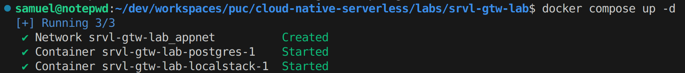
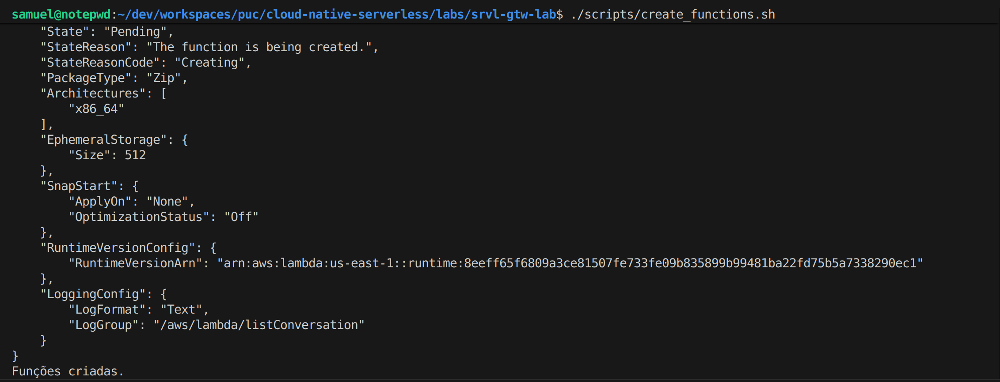
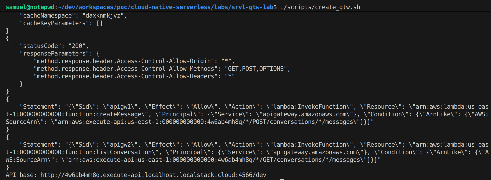
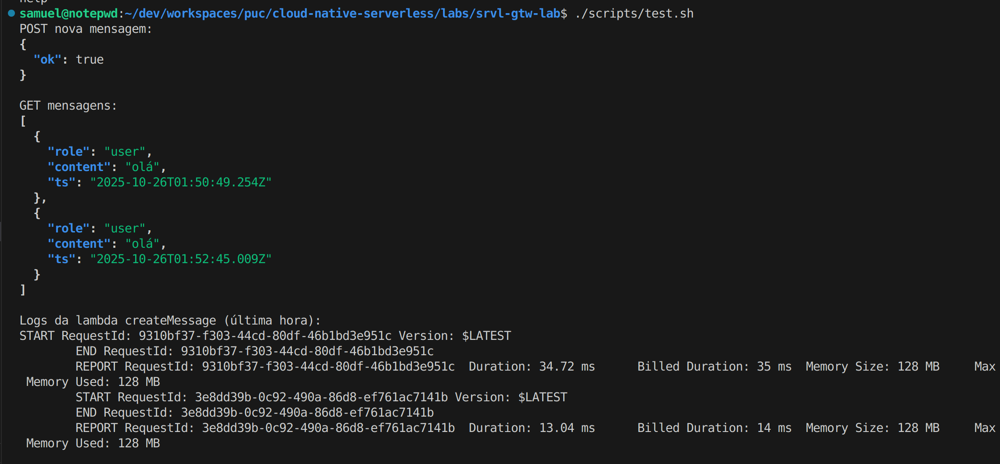

# Serverless + API Gateway (LocalStack) — Persistência de Conversas (Postgres)

Este lab cria uma API **Serverless** (AWS Lambda + **API Gateway v1 – REST API**, emulado com **LocalStack**) que **persiste e lista** mensagens de conversas em um **Postgres** local (via Docker Compose).

---

## O que você vai construir

- **Banco:** Postgres com tabela `messages` (inicializado por `sql/init.sql`);
- **Lambdas:**
  - `createMessage` → **POST** `/conversations/{id}/messages`
  - `listConversation` → **GET**  `/conversations/{id}/messages`
- **API Gateway v1 (REST API):** integração **Lambda Proxy** para ambas as rotas;
- **Logs:** CloudWatch (emulado pelo LocalStack).

---

## Pré-requisitos

> Se você **ainda não tem Docker** ou as CLIs, siga as instruções abaixo.

### 1) Docker (inclui Docker Compose v2)

**Linux (atalho oficial):**
```bash
curl -fsSL https://get.docker.com | sh
sudo usermod -aG docker "$USER"
# faça logoff/login ou: newgrp docker
docker --version
docker compose version
```

> Em Windows/Mac use o **Docker Desktop** (ele já traz o Compose v2).

### 2) Python + pip + CLIs

Instale os binários necessários (usando `pip`):
```bash
# Pré-requisito: ter o 'pip' (geralmente vem com o Python) e o 'awscli'
pip install awscli

# Instalar o wrapper do LocalStack
pip install awscli-local
```

> Os scripts detectam automaticamente o `awslocal`. Se ele não estiver disponível, usam `aws --endpoint-url=http://localhost:4566`.

### 3) Node.js, `jq` e `zip`

Qualquer Node 18+ funciona. Em Ubuntu/Debian:
```bash
sudo apt-get update
sudo apt-get install -y jq zip
```

---

## Imagens (resultado esperado)

| Etapa | Screenshot |
|------:|:-----------|
| 1. Containers no ar |  |
| 2. Criação das Lambdas |  |
| 3. Criação do API Gateway (REST v1) |  |
| 4. Testes (POST/GET + logs) |  |

---

## Estrutura do projeto

```
srvl-gtw-lab/
├─ docker-compose.yml
├─ sql/
│  └─ init.sql
├─ scripts/
│  ├─ create_functions.sh
│  ├─ create_gtw.sh
│  └─ test.sh
├─ lambda-create/
│  ├─ handler-create.js
│  └─ package.json
└─ lambda-list/
   ├─ handler-list.js
   └─ package.json
```

---

## Passo a passo

### 0) Permissões nos scripts (necessário antes de executar)
```bash
chmod +x scripts/*.sh
```

### 1) Subir a infraestrutura local
```bash
docker compose up -d
```
- Sobe `localstack` (porta `4566`) e `postgres` (porta `5432`).
- O Postgres é inicializado com `sql/init.sql`.
- O LocalStack já recebe `LAMBDA_DOCKER_NETWORK=srvl-gtw-lab_appnet` para as Lambdas enxergarem o host `postgres`.

### 2) Criar as funções Lambda (zip + envs do DB)
```bash
./scripts/create_functions.sh
```
O script:
- Instala dependências (`npm i --omit=dev`);
- Empacota (`zip`) `node_modules` + handler;
- Cria as funções no LocalStack (runtime `nodejs20.x`) passando as variáveis do Postgres.

### 3) Criar a API Gateway (REST v1) e integrar
```bash
./scripts/create_gtw.sh
```
O script:
- Cria a **REST API** e os recursos `/conversations/{id}/messages`;
- Cria métodos **POST** e **GET** com integração **AWS_PROXY** para as duas Lambdas;
- Adiciona `OPTIONS` (MOCK) para **CORS** (`*` + `GET,POST,OPTIONS`);
- Concede permissões de invocação ao API Gateway;
- Faz o deploy no stage `dev`;
- Grava o endpoint base em `.apibase.env` (variável `BASE`), por ex.:
  ```
  http://{restId}.execute-api.localhost.localstack.cloud:4566/dev
  ```

### 4) Testar a API
```bash
./scripts/test.sh
```
Você verá:
- `POST` de uma nova mensagem (role/content) para `conversation_id = demo`;
- `GET` listando mensagens;
- Logs recentes da Lambda `createMessage` (o script detecta CLI v1/v2).

> Teste manual adicional:
```bash
source .apibase.env

curl -s -X POST "$BASE/conversations/demo/messages"   -H 'content-type: application/json'   -d '{"role":"user","content":"olá"}' | jq .

curl -s "$BASE/conversations/demo/messages" | jq .
```

---

## Formato das rotas

### `POST /conversations/{id}/messages`
**Body (JSON)**
```json
{
  "role": "user",
  "content": "olá"
}
```
**Respostas**
- `201 { "ok": true }` em sucesso
- `400` se payload inválido
- `500` erro interno

### `GET /conversations/{id}/messages`
**Resposta**
```json
[
  {"role":"user","content":"olá","ts":"2025-01-01T12:00:00.000Z"}
]
```

---

## Solução de problemas

- **LocalStack não responde na 4566**  
  Verifique `docker compose ps` e `docker logs srvl-gtw-lab-localstack-1`.

- **Erro de conexão ao DB**  
  Confirme envs das Lambdas (host `postgres`, porta `5432`) e se o container do Postgres está `healthy`.  
  Para recriar do zero:
  ```bash
  awslocal lambda delete-function --function-name createMessage || true
  awslocal lambda delete-function --function-name listConversation || true
  ./scripts/create_functions.sh
  ```

- **Rotas 403/404**  
  Rode `./scripts/create_gtw.sh` novamente e confirme o `.apibase.env`.

- **Logs (AWS CLI v1 vs v2)**  
  O `test.sh` detecta se o comando `aws logs tail` (CLI v2) está disponível; se não estiver, usa `filter-log-events` (CLI v1).

- **HTTP API (v2)**  
  Este projeto usa **REST API (v1)** para compatibilidade com o LocalStack Free.

---

## Limpeza
```bash
docker compose down -v
```
Remove containers e volume do Postgres.

---